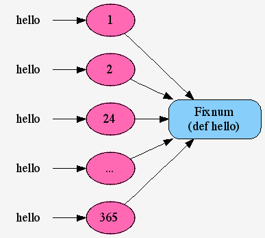

!SLIDE subsection transition=fade
# メソッド定義

!SLIDE bullets
* <strong class='ruby'>Ruby</strong>で
* 「プログラミングをする」
* というのは

!SLIDE bullets
* 「オブジェクトにメッセージを送る」
* とほぼ同義である

!SLIDE bullets
* 自由で柔軟な
* プログラミングを
* 実現するため

!SLIDE bullets
* <strong class='ruby'>Ruby</strong>の設計者は
* 大量の
* メソッドを用意した

!SLIDE bullets
* しかし
* もちろんそれだけでは
* 真に自由なプログラミングが
* できるわけではない

!SLIDE bullets
* 独自メソッドが
* 定義できてこそ
* 本当のプログラミングが
* 実現できる

!SLIDE bullets
* そして<strong class='ruby'>Ruby</strong>は
* それをあなたに許す

!SLIDE bullets
* 今あなたが
* １に挨拶したら
* 返事がほしいとしよう

!SLIDE bullets
* １の中身は空っぽで
* <strong class='green'>Fixnum</strong>クラスが
* メソッドを持っている
* ことを思い出そう

!SLIDE bullets
* そうあなたのメソッドも
* <strong class='green'>Fixnum</strong>クラスに追加すればいい

!SLIDE execute

    @@@ruby
    class Fixnum
      def hello
        "Yo!"
      end
    end

!SLIDE bullets
* さあ
* あなたから１に挨拶を！

!SLIDE commandline incremental

    $ 1.hello
     # => "Yo!"

!SLIDE bullets
* もう少し気の利いた返事がほしいなら
* メッセージが別のオブジェクトを
* 受け取れるようにすればいい

!SLIDE bullets

    @@@ruby
    class Fixnum
      def hello(name)
        "Yo! #{name}"
      end
    end

!SLIDE bullets
* そしてあなたの名前を渡す

!SLIDE commandline incremental

    $ 1.hello("Charlie")
     # => "Yo! Charlie"

!SLIDE bullets
* ここまでの説明が理解できたなら
* 挨拶に答えられるようになったのが
* １だけではない
* ということが分かるだろう

!SLIDE commandline incremental

    $ 2.hello("Ken")
     # => "Yo! Ken"

    $ 24.hello("ジャック・バウアー")
     # => "Yo! ジャック・バウアー"

    $ 365.hello(365)
     # => "Yo! 365"

!SLIDE bullets
* そう今や
* <strong class='green'>Fixnum</strong>クラスに属する
* すべての数字が

!SLIDE bullets center
* あなたが作った
* <strong class='orange'>hello</strong>に答えられる！

!SLIDE bullets
* 先のコードの最後の式を見て
* ドキリとする人もいるかもしれない

!SLIDE bullets
* メソッドに渡すオブジェクトを
* 「引数」と呼ぶけれども

!SLIDE bullets
* 渡されるものが
* オブジェクトである限り
* <strong class='ruby'>Ruby</strong>は
* それを引数として受け入れる

!SLIDE bullets
* 上の２つは
* 文字列のオブジェクトを
* 引数として渡し

!SLIDE bullets
* 最後のものは今まで見てきた
* 数のオブジェクトを渡している

!SLIDE bullets
* すでにオブジェクトからの応答が
* オブジェクトであることを
* 理解したあなたなら

!SLIDE bullets
* 次のコードも理解できるだろう

!SLIDE commandline incremental

    $ 1.hello(2.hello("Ma"))
     # => "Yo! Yo! Ma"

!SLIDE commandline incremental end

    $ at_exit {
    $ 　puts "Thank you for watching!"
    $ }

